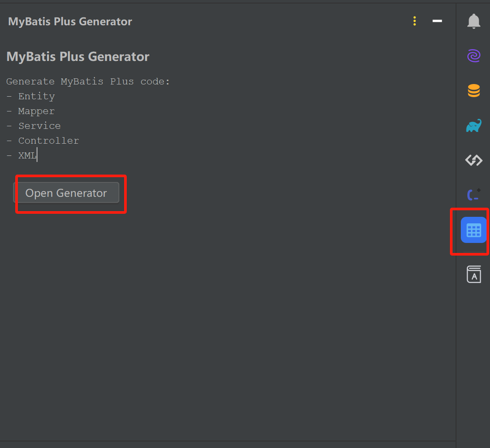
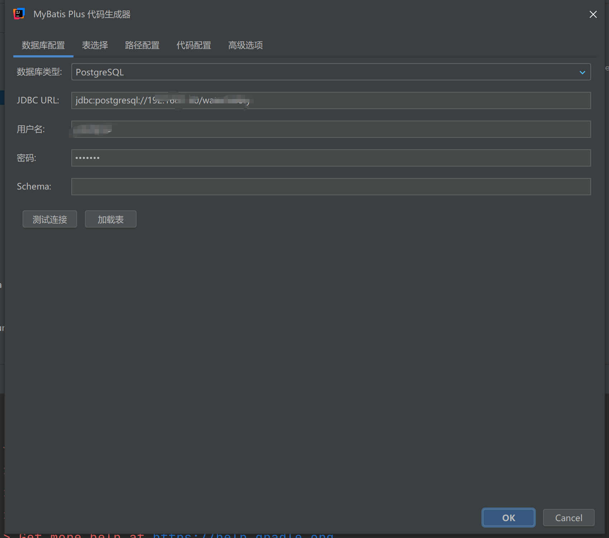
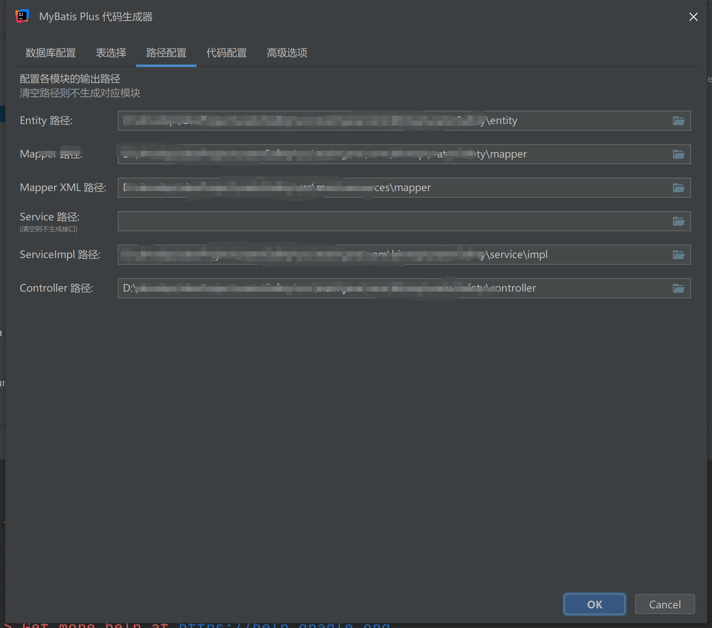
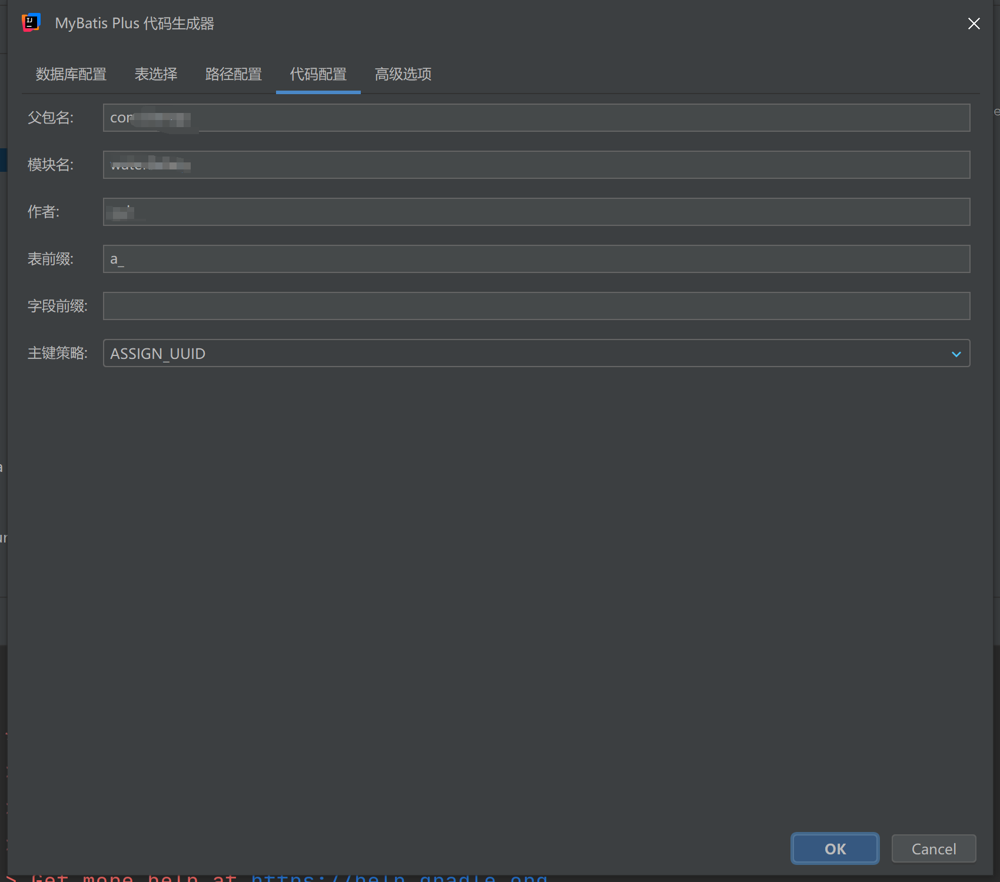
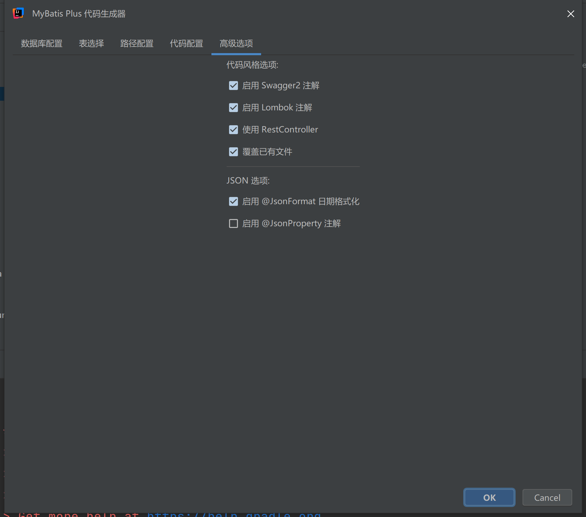

# MyBatis Plus Generator Plugin

IntelliJ IDEA 插件 - MyBatis Plus 代码生成器

## 功能特性

- **多数据库支持**: MySQL, PostgreSQL, Oracle, 达梦数据库
- **可视化界面**: 图形化配置数据库连接和代码生成选项
- **自定义模板**: 支持 Freemarker 模板引擎
- **代码生成**: 自动生成 Entity, Mapper, Service, Controller, XML

## 截图预览

<table>
  <tr>
    <td></td>
    <td></td>
  </tr>
  <tr>
    <td></td>
    <td></td>
  </tr>
  <tr>
    <td colspan="2" align="center"></td>
  </tr>
</table>

## 安装方式

### 方式一：从 JetBrains Marketplace 安装
1. 打开 IntelliJ IDEA
2. 进入 `Settings` -> `Plugins` -> `Marketplace`
3. 搜索 "MyBatis Plus Generator"
4. 点击 `Install` 安装

### 方式二：本地安装
1. 下载插件 zip 文件
2. 进入 `Settings` -> `Plugins` -> `⚙️` -> `Install Plugin from Disk...`
3. 选择下载的 zip 文件

## 使用方法

### 方式一：通过菜单启动
1. 点击菜单 `Tools` -> `MyBatis Plus Generator` -> `生成代码...`

### 方式二：通过快捷键
- Windows/Linux: `Ctrl + Alt + G`
- macOS: `Cmd + Alt + G`

### 方式三：右键菜单
- 在项目视图中右键 -> `MyBatis Plus 生成代码...`

## 配置说明

### 数据库配置
| 字段 | 说明 |
|------|------|
| 数据库类型 | 选择 MySQL/PostgreSQL/Oracle/DM |
| JDBC URL | 数据库连接地址 |
| 用户名 | 数据库用户名 |
| 密码 | 数据库密码 |
| Schema | 数据库 Schema（可选） |

### 代码配置
| 字段 | 说明 |
|------|------|
| 父包名 | 生成代码的基础包名 |
| 模块名 | 模块名称（可选） |
| 输出目录 | 代码输出目录 |
| 作者 | 代码作者信息 |
| 表前缀 | 需要过滤的表前缀 |
| 字段前缀 | 需要过滤的字段前缀 |

### 高级选项
| 选项 | 说明 |
|------|------|
| Swagger2 | 生成 Swagger2 注解 |
| Lombok | 使用 Lombok 注解 |
| RestController | 使用 RestController 风格 |
| JsonFormat | 日期字段添加 @JsonFormat |
| JsonProperty | 添加 @JsonProperty 注解 |

## 构建项目

```bash
# 构建插件
./gradlew buildPlugin

# 运行 IDE 测试插件
./gradlew runIde

# 发布插件
./gradlew publishPlugin
```

## 开发环境要求

- JDK 17+
- IntelliJ IDEA 2023.3+
- Gradle 8.5+

## 项目结构

```
mybatis-plus-generator-plugin/
├── build.gradle.kts          # Gradle 构建配置
├── settings.gradle.kts       # Gradle 设置
├── gradle.properties         # Gradle 属性
├── src/
│   └── main/
│       ├── java/
│       │   └── com/mybatisplus/generator/
│       │       ├── action/           # 菜单 Action
│       │       ├── service/          # 生成器服务
│       │       ├── settings/         # 配置管理
│       │       └── ui/               # 对话框 UI
│       └── resources/
│           ├── META-INF/
│           │   └── plugin.xml        # 插件描述文件
│           └── templates/            # 代码模板
└── gradle/
    └── wrapper/                      # Gradle Wrapper
```

## 许可证

MIT License

## 贡献指南

欢迎提交 Issue 和 Pull Request！
